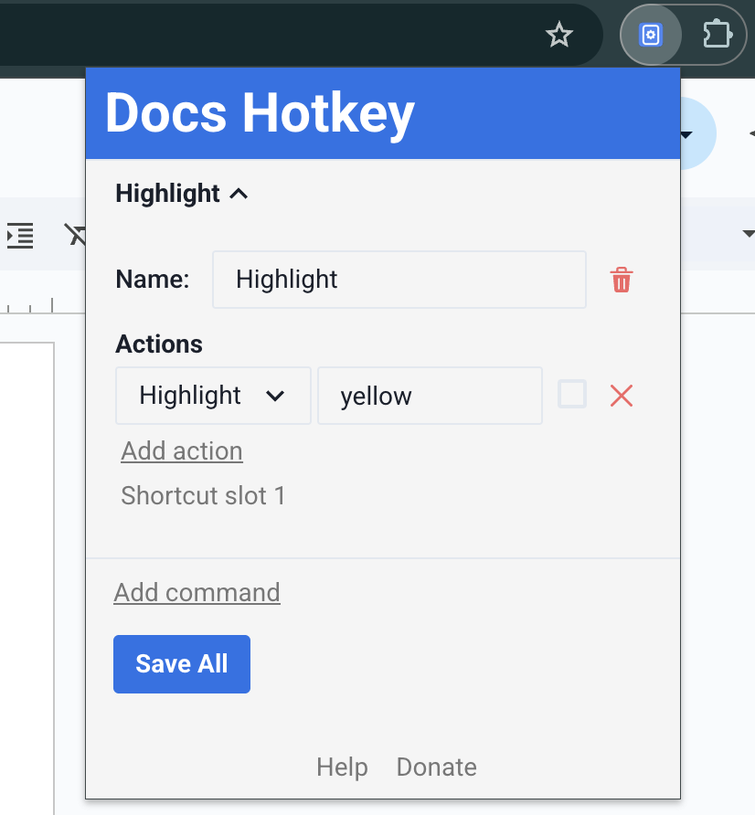

# Docs Hotkey

## Overview

Docs Hotkey is a free, open-source Chrome extension for creating custom keyboard shortcuts in Google Docs.
Originally, it was made solely to add a highlighting shortcut, but other formatting shortcuts have since been added.
Hotkeys can currently be configured to:

- Highlight in any color
- Bold
- Underline
- Italicize
- Change text color
- Change fonts
- Change font size
- Set heading type (e.g., Heading 1, Normal Text, Title)
- Strike through text
- Change alignment and indentation
- Add emoji reactions
- Add bulleted lists and set their spacing
- Clear all styles and remove specific styles
- Insert building blocks
- Execute add-ons

## Demo

    <iframe
        src='https://www.youtube-nocookie.com/embed/XHJ9cBlmpQE?controls=1&rel=0'
        title='YouTube video player'
        allow='accelerometer; autoplay; clipboard-write; encrypted-media; gyroscope; picture-in-picture'
        allowFullScreen
    ></iframe>

## Installation

Docs Hotkey is available for free on the [Chrome Web Store](https://chromewebstore.google.com/detail/docs-hotkey/npkpplmpfeaeemeecniaikpjjfbfefhh?hl=en).
After installing the extension or updating a hotkey, you may need to refresh any Google Docs tabs.
Alternatively, you may build the extension from its source code using the instructions on the [Building from Source](build.md) page.

## Getting Started

As a simple introduction, we'll create a hotkey to highlight the selected text.
To start, open a Google Doc and click on the Docs Hotkey extension in the toolbar.
Then, click on the "Add Command" button.

You've just created your first command! A command is run whenever a keyboard shortcut is pressed, and it directs Docs Hotkey on what actions to perform on the document.

Give this new command a name and add a "Highlight" action by clicking "Add action" and selecting "Highlight" from the dropdown menu.
The next textbox specifies the configuration for the action. In this case, the highlight action needs a color here, so we'll pick yellow.

Click "Save All" to register your new command.

Finally, navigate to chrome://extensions/shortcuts in your browser by typing it in the search bar.
Find the section for Docs Hotkey and edit the shortcut for "Slot 1" — you can find this slot number
for any of your commands on the extenion pop-up.

Your hotkey is good to go! Select some text, press the keyboard shortcut you chose, and your text will instantly be highlighted.
If you're having trouble getting it to work, you may need to refresh the Docs page.

