### A Chrome extension for easily styling content on Google Docs with hotkeys

---

Docs Hotkey allows for complex hotkey setups with simple configuration. Hotkeys can be set up to do the following:

- Highlight in any color
- Bold
- Underline
- Italicize
- Change fonts
- Change font size
- Set heading type (e.g., Heading 1, Normal Text, Title)
- Clear all styles (and remove specific styles)

A single hotkey can be configured to do several of these at once.

<video controls width="100%">
  <source src="https://user-images.githubusercontent.com/64462489/178075172-5f7ef0b2-1af4-4c0b-a1cb-ad9672e3d089.mp4" type="video/mp4" />
  Sorry, your browser doesn't support embedded videos.
</video>

## Table of Contents

- [Usage](#usage)
  - [Installation](#installation)
  - [Create a command](#create-a-command)
  - [Action configuration](#action-configuration)
    - [Toggle](#toggle)
    - [Highlight configuration](#highlight-configuration)
    - [Font configuration](#font-configuration)
    - [Heading configuration](#heading-configuration)
    - [Align configuration](#align-configuration)
  - [Set a keyboard shortcut](#set-a-keyboard-shortcut)
    - [Which shortcut slot is my command in?](#which-slot-is-my-command-in)
- [Bugs and feature requests](#bugs-and-feature-requests)
- [License](#license)

# Usage

## Installation

Docs Hotkey is published on the Chrome Web Store [here](https://chrome.google.com/webstore/detail/docs-hotkey/eafjegmepdcjogimhmjgppflbeioline).

## Create a command

A command is something that will be linked to a hotkey. To create your first command, click on the extension icon and then `Add command`.

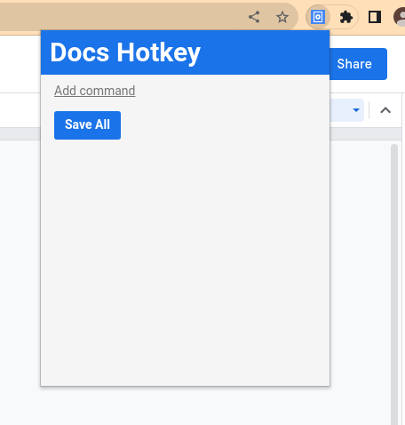

Click on the new command to show its configuration.

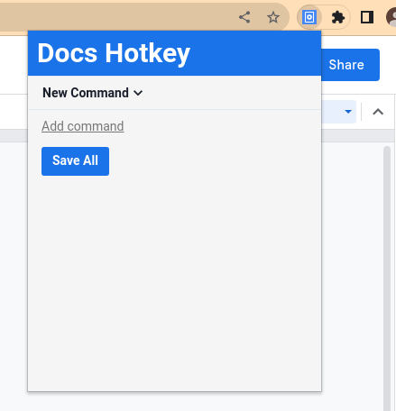

A command's configuration contains its name and one or more actions that will run whenever it is activated. To delete a command, click the trash icon next to its name.

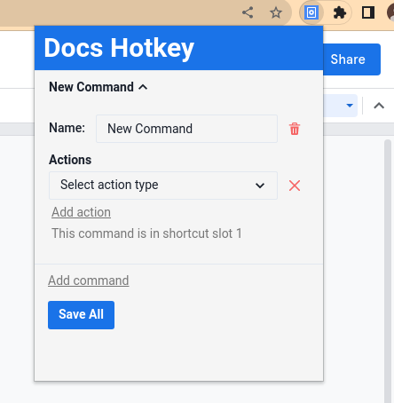

Clicking on `Select action type` will open a drop-down with which you can select which action the command should perform. When you are finished configurating a command, you must hit `Save All` to save your changes. If you save your changes and don't notice a change in your hotkeys, try refreshing the page (this usually isn't necessary).

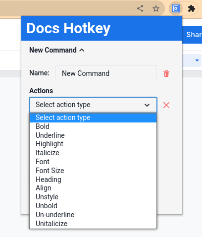

## Action configuration

Some actions have extra configuration you can use to tailor them to your needs.

### Toggle

The `bold`, `underline`, `highlight`, and `italicize` actions have a toggle setting. If this is activated, then the action will do the reverse of the action if the text is already bolded, underlined, highlighted, or italicized, respectively. For example, the `bold` action will unbold text if it is already bolded. If toggle is turned off, then text that is already bold will stay bold.

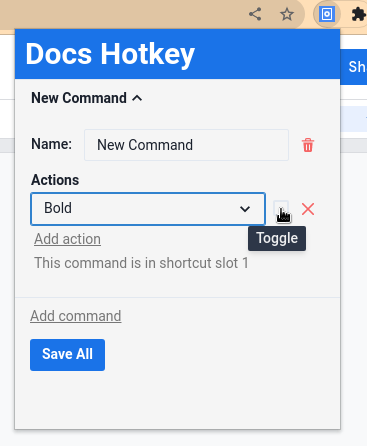

### Highlight configuration

The `highlight` action has a configuration option for the color of the highlight. This can be changed by changing `yellow` to another color. To remove highlight, change `yellow` to `none`.

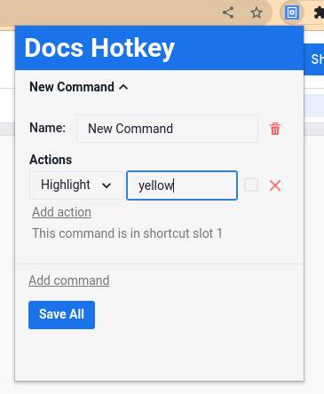

Docs Hotkey is able to highlight in all of the colors in the Google Docs color palette. To find the name of a color you wish to highlight in, open the highlight menu in Google Docs and hover over the color. This will show a tooltip with the name of the color, which can be entered into the `highlight` configuration.

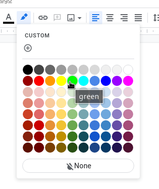

### Font configuration

The `font` action changes the font family of the given text. The configuration box will accept the name of any font supported by Google Docs. Note that this action uses the font dropdown in Google Docs, so make sure that any font you wish to use is either in your recent fonts or the list of fonts that Google Docs shows by default.

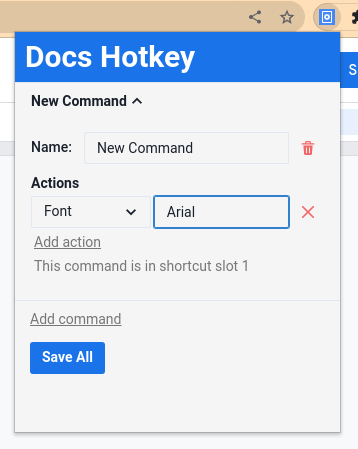

### Heading configuration

The `heading` action changes the type of text in Docs (e.g., Normal text, Heading 1, and Title).

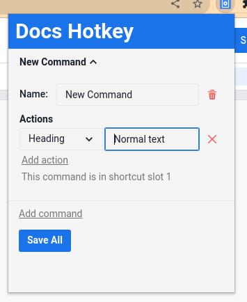

This action will accept any value in the following drop-down:

### Align configuration

The `align` action accepts any of the following values in its configuration field: `left`, `center`, `right`, or `justify`.

## Set a keyboard shortcut

In order to actually use a command, you need to link it to a shortcut. To do this, go to <chrome://extensions/shortcuts> and click the edit icon for whichever slot your command is in. Then, simply press the keys for the shortcut and your command will now be run whenever you hit those keys on Google Docs! By default, the command in slot 1 will be set to the shortcut `Control+Shift+H`.

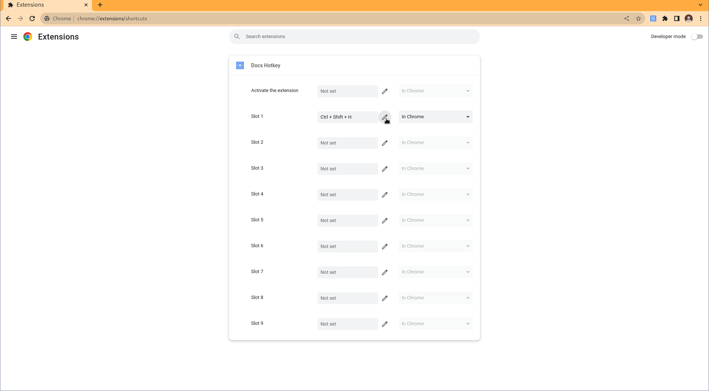

### Which slot is my command in?

The configuration of your command shows which shortcut slot a command is in. This is automatically assigned and cannot be changed.

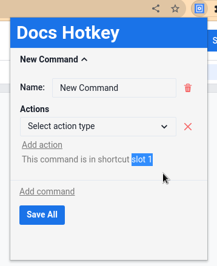

Because Chrome only allows for 10 keyboard shortcuts per extension, the maximum number of hotkeys you can have at once is 10.

# Bugs and feature requests

Bugs and feature requests can be submitted on GitHub at <https://github.com/ZackMurry/docs-hotkey/issues> or can be emailed to <docshotkey@zackmurry.com>.

Bugs are very likely to occur when Google updates the UI for Docs. The `heading` action is particularly unstable.

# License

This is free, open-source software licensed under the MIT License. The full license can be found [here](https://raw.githubusercontent.com/ZackMurry/docs-hotkey/main/LICENSE).

To contribute, visit <https://github.com/ZackMurry/docs-hotkey>.

Created by Zack Murry.
